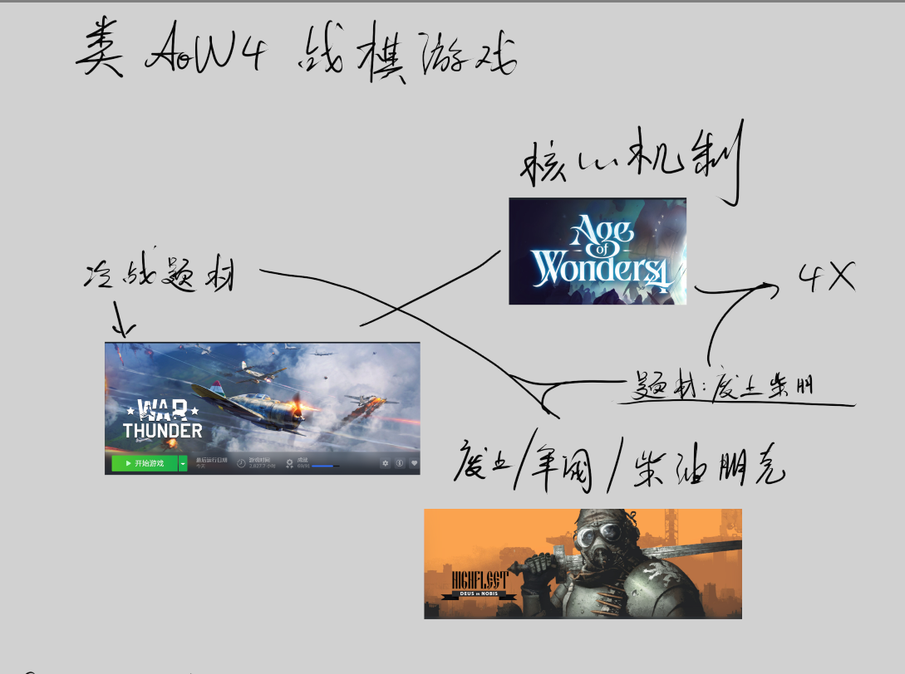
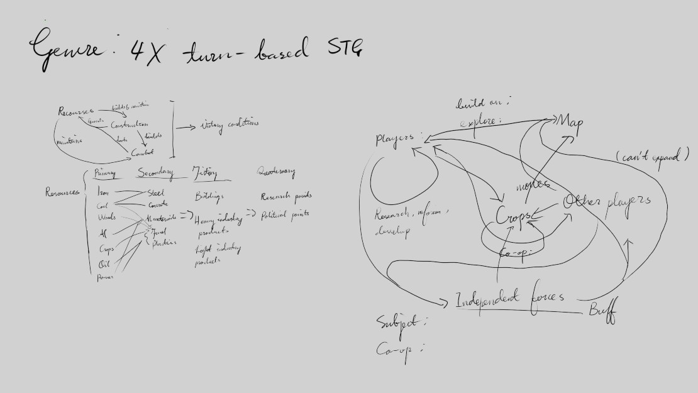

# GDIM 33 In-Class Activities
## W1
### Activity 1
Put your inspo board link here. Do NOT leave a bare URL. REMOVE ALL INSTRUCTIONAL TEXT.

1. The pattern that emerges in my mind is a 4x game. It is very much like Civ or AoW, but in a post-apocalytic world, with cold war tech level. The player plays as one of the warlords in the world, control resources, and seek to be the most powerful warlord in the map. What makes the game special is the simulation of a real-world command line, with HQ's, airforce, front-line units, supports and special forces. I have came up with two victory conditions: one being the first warlord who invents a nuclear bomb, another being the warlord most supported by the people by befriending independent npc forces and gaining advantages against other warlords in political offense. 
2. My personal style is very different from my table mates. I am more into rts games and 4x games like Paradox Interactive games and games like Civ or AoW4. While my table mates are more into gotcha games, act and fps. Death Stranding is also a popular game among our table. All of my table mates and I played War Thunder, which is one aspect similar. 

### Activity 2

## W2
Write your W2 Devlog here.

Continue adding additional headers below this one for future weeks and future activities.
