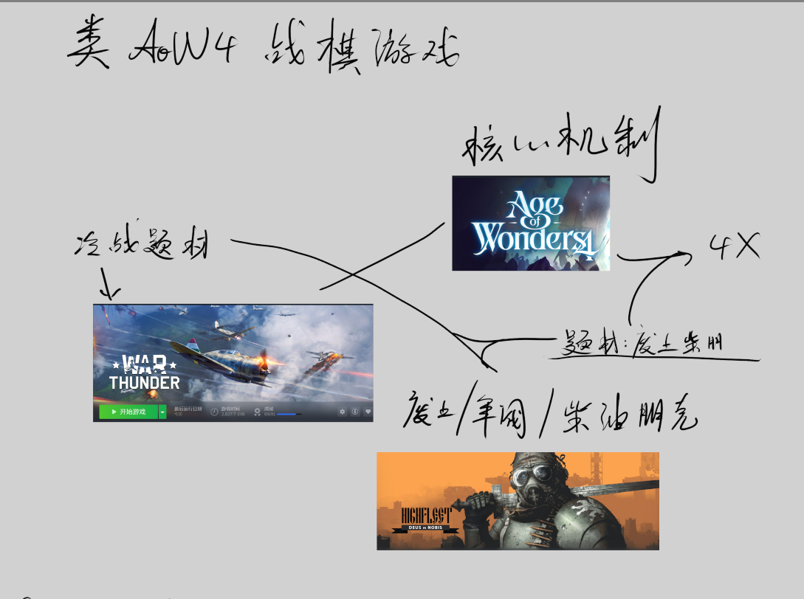
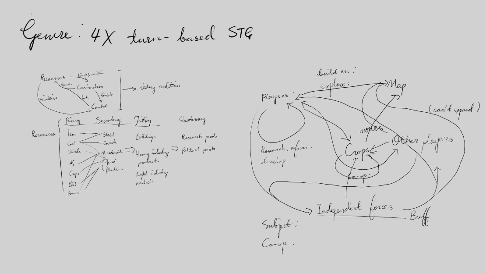
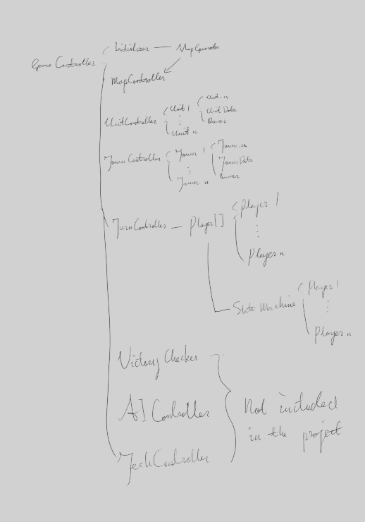
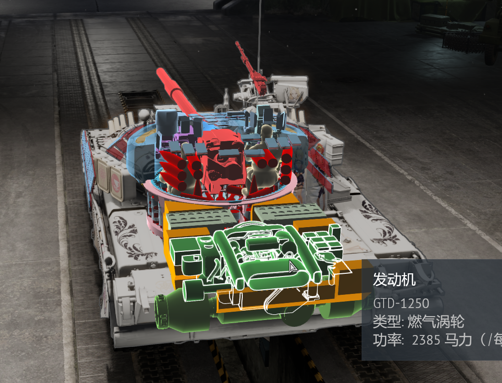

# GDIM 33 In-Class Activities
## W1
### Activity 1
1. The pattern that emerges in my mind is a 4x game. It is very much like Civ or AoW, but in a post-apocalytic world, with cold war tech level. The player plays as one of the warlords in the world, control resources, and seek to be the most powerful warlord in the map. What makes the game special is the simulation of a real-world command line, with HQ's, airforce, front-line units, supports and special forces. I have came up with two victory conditions: one being the first warlord who invents a nuclear bomb, another being the warlord most supported by the people by befriending independent npc forces and gaining advantages against other warlords in political offense. 
2. My personal style is very different from my table mates. I am more into rts games and 4x games like Paradox Interactive games and games like Civ or AoW4. While my table mates are more into gotcha games, act and fps. Death Stranding is also a popular game among our table. All of my table mates and I played War Thunder, which is one aspect similar. 
3. The taste of the LA of my table is also very different from mine. His taste is more similar to that of my table mates, interested in act or fps games other than my preferences. I am not saying that I dont play act or fps at all but I certainly do not invest most of my time is these two. 

### Activity 2

## W3
### Activity 1

### Activity 2
1. It makes the event name changable. If I need to change the name of it, I only need to change it in one place, instead of clicking into every script with it. It makes the script more maintainable. 
2. It makes it convenient to verify if clicking the walrus actually triggers the event as expected. It makes debugging much easier and helps find logical errors, which will not be reflected by the system. 
3. I dont think that I will need this because this is a 4x game in which mouse clicking is the core input, just like on the desktop. 
4. It is relevant because it is a turn-based game, so the game has to decide whose turn to act it is. 

## W4
### Activity 1
1. The system can automatically generate a map based on a set of value and a seed in the map generation inspector. There is a console in which the player can input command to regenerate the map or to output map data. The map is not yet rendered, so there is only the skybox and console ui displayed. The current playtesting goal is to test if the map generation function and the console functions normally as expected without major bugs.
2. Allen Gu, Haoyi Zhang, Pengcheng Qi, Ryan Yang, Yaokun Wan 
3. All the teamates dont know what to do at all becasue there is no guide to use the console (the only directly-interactable part). After the guidance, they can use the console to regenerate the map and check map data. The response is that the map generation function could be interesting, but I need to render it out so that it can be shown directly to the players. 
### Activity 2
1. Yes, because more contents can be added by scriptable objects, without having to write any code.
2. There can be at most 4, becasue buttons will be place out of the screen if more are added.
3. It refreshes the visual scripting graph to reflect any changes made to the underlying code, so that all nodes and connections are up to date.

## W5
### Activity 1
I will need to build the features of movements of units. 
1. Build the framework, including the unit scriptable object and the basic logics; debugs will be logged when DebugMode is on.
2. Test the logic in game to make sure that it runs properly. 
3. Add artistic assets and related logic to the units so that they can be shown to the players.
### Activity 2
1. Fixed the bug of the camera movement logic. It is now stable.
2. Revised the map generation logic, so that it generates smoother landforms.
3. Built the unit scriptable object. 

## W6
### Activity 1
1. I made the data framework and the movement logic of units, but since they are not yet interactable objects in game, they cannot be tested.
2. https://ji-ying114.itch.io/vertical-slice-milestone-2
3. The game can generate a map and move the camera around now, but is not yet a game. I need to focus on the core mechanics to build the game loop to make it really playable. 
### Activity 2
1. Becasue all colors have a value between 0.0f and 1.0f, so multiplying will make each value either the same or smaller.
2. It will make the resulting value more translucent because the alpha value is also between 0.0f and 1.0f, so multiplying will make the final value either equal to or smaller than the original values. 
3. The shader gets the UV values from the vertex data where each vertex stores its own texture coordinates as part of its vector information.
4. It does not, because I have been doing so (been tortured by it) for a long time :D

## W7
1. The data for the Vertex Color node comes from the color attribute stored within each vertex of the Shiba mesh.
2. The colors are blended at the edges because the GPU interpolates the per-vertex color data across the surface of each polygon during rendering.
3. Vertex color looks less detailed because color data is only stored per-vertex and interpolated, unlike a texture which stores unique color information per-pixel; this makes it useful for ambient occlusion baking, LOD coloration, or vertex painting masks.
4. The visualization shows the back-left leg has a dark patch, which may indicate incorrect or inverted normals on that part of the mesh.
5. You could debug UV coordinates by outputting them as R and G colors to check for stretching or seams, which is useful for validating texture mapping.
6. The lighting error occurred because the light direction vector and the surface normal were pointing toward each other, producing a negative dot product (darkness) instead of a positive one.
7. Additive blend mode was chosen because it makes black areas fully transparent and creates a bright, glowing effect that naturally mimics fire.

## W8
### Activity 1
1. I fixed the bugs of the logic of converting the world and the map positions. I re-structured the code, and the turn manager and the game manager are integrated into a new game manager. 
2. https://ji-ying114.itch.io/milestone3
3. My playtesting goal: test if the movement system works as expected. 
4. Playtesting notes: the players can play the game without instructions and discover all the features. It was said that I needed to add more contents to my game in order to make it more playable, and a player expects more interaction with the map. A bug was found: the movement range does not calculate correctly. I think it is because of either the direction helper, which gives the wrong map position data, or the search logic that calculates and returns the positions that are in the movement range.
### Activity 2b
1. It convert the ever-increasing time into a looping 0 to 1 value, which makes the UV continuously scroll. 
2. So that it does not affect the color of the base sprite before the shine texture was added when added with the MainTex. 
3. Becuase the sprite renderer automatically replaces the MainTex with the object's own sprite, so they show their own textures.
4. Because the former makes the value increase faster (so its fraction increases faster correspondingly); the latter can casue the final value to be greater than 1, which breaks the continuous scrolling.

## W9
### Activity 1
The game chosen: War Thunder

To make War Thunder'internal structure s X-ray and mouse-over outline effects in Unity, we can split the vehicle model into an opaque internal structure  and a semi-transparent surface skin, rendered later with Transparent queue so that the former naturally shows through the translucent hull. For the highlight outline, we can detect the part with raycast and draw its inflated mesh in a final pass after all transparent objects, using a queue like Overlay or injecting through a CommandBuffer at the AfterRenderingTransparents event to keep the contour sharp on top.
### Activity 2

1. I added a new shader graph.
2. I drew a asset by hand.
3. fixed the bug that the game collapses when the player proceeds to the next turn while the unit animation is still playing